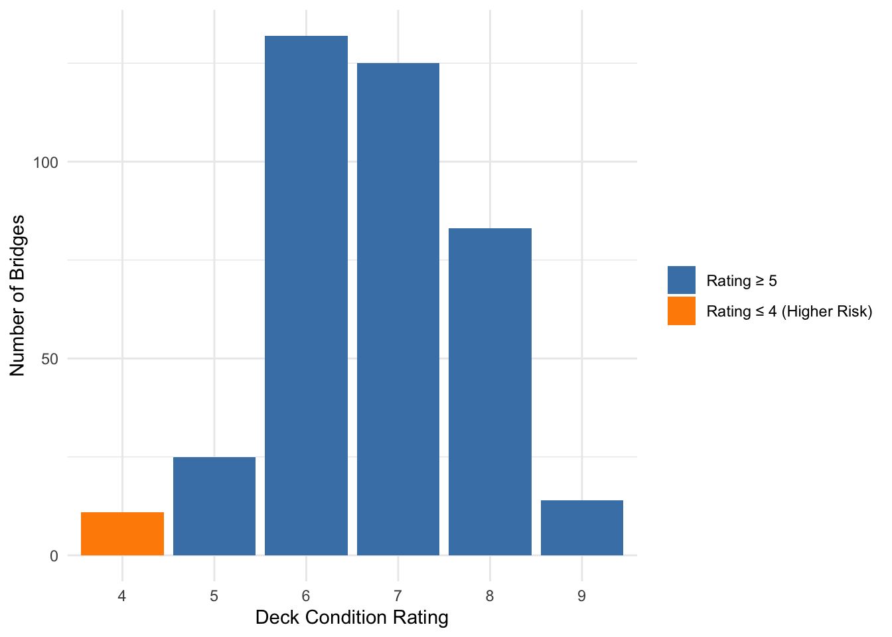
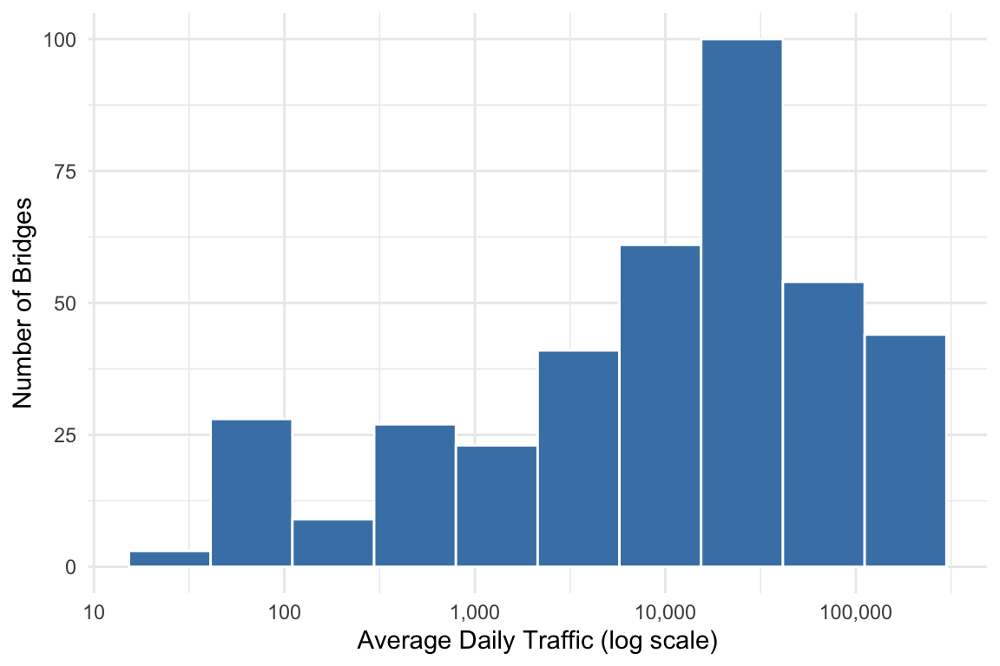
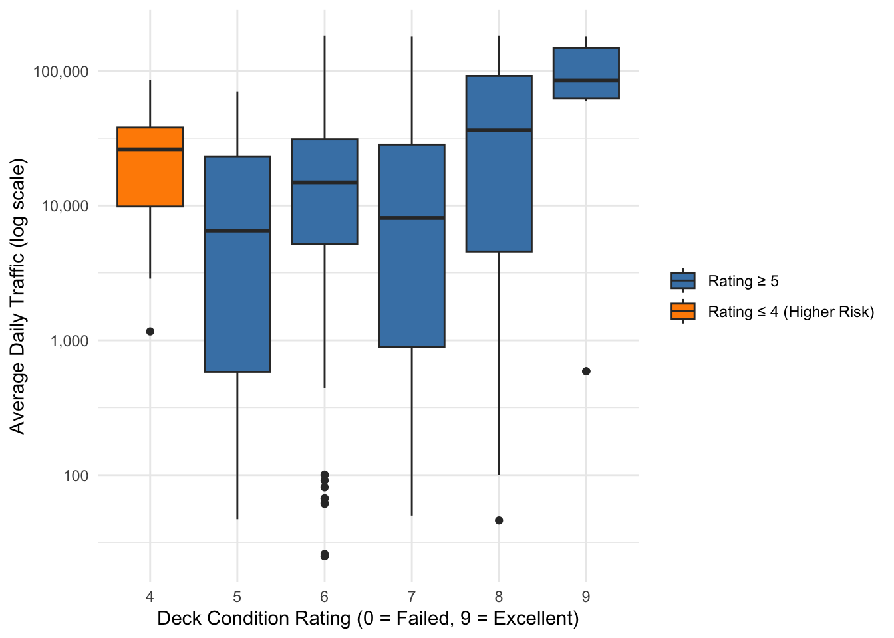

## Why this matters

- Over 40,000 bridges in the U.S. are structurally deficient
- Bridge failure → safety risks + economic disruption
- Condition alone does NOT capture real risk

## Objective

- Evaluate bridge risk in Omaha
- Combine:
  - Structural condition (failure risk)
  - Traffic volume (impact)
- Identify bridges needing urgent attention

## Data Overview

- 390 bridges in Douglas County (2025 data)
- Source: Federal Highway Administration (NBI)

Key variable:

- Condition ratings (0-9 scales)
- Bridge age
- Average Daily Traffic (ADT)

## Risk Framework

Higher-risk bridges:

  - Condition rating ≤ 4 (deck, superstructure, or substructure)

Risk = 

  - Likelihood → structural condition
  - Consequences → traffic volume (ADT)

## Key Statistics

- Total bridges: 390
- High-risk bridges: 16 (4.1%)

- Average Age:
  - High-risk = ~70 years
  - Other: ~40 years
  
- Traffic range:
  - 25 → 182,000 vehicles/day
  
## Structural Condition

- Most bridges rated 5-7 (fair to good)

- Older bridges → worse condition

  - Correlation: $\rho$ = -0.40
  
- Age is a risk factor

{width=80%}

## Traffic Exposure
- Traffic varies widely across bridges  
- Some bridges carry >100,000 vehicles/day  

- Weak relationship between:
  - Condition and traffic ($\rho$ = 0.17)  
→ High-traffic bridges are NOT better maintained 

{width=80%}

## Highest Risk Scenario
- Some low-condition bridges (≤4)  
- Still carry tens of thousands of vehicles/day  

→ High failure risk + high impact  

These are the MOST critical bridges

{width=80%, fig-align="right"}

## Recommendations

- Prioritize the 16 high-risk bridges immediately  
- Focus on:
  - Older structures  
  - High-traffic bridges  

- Use BOTH:
  - Condition + traffic for decision-making 
  
## Conclusion

- Bridge risk is concentrated in a small group  
- Most bridges are in fair condition  
- Risk-based prioritization improves safety and efficiency  